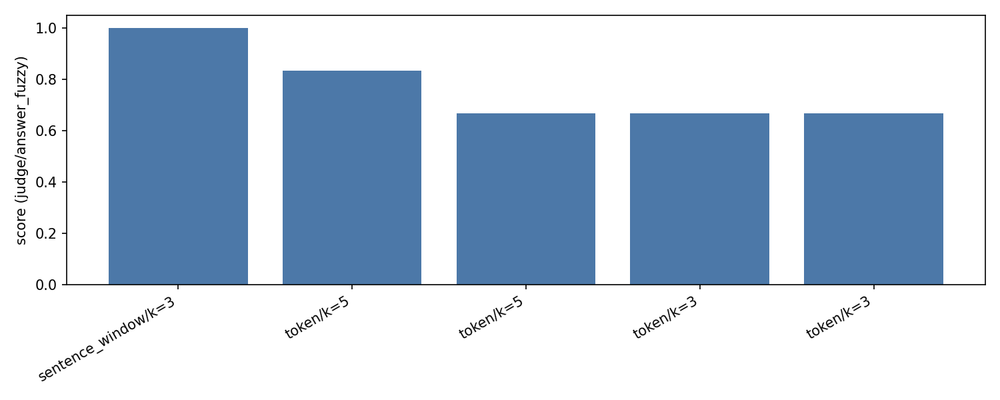
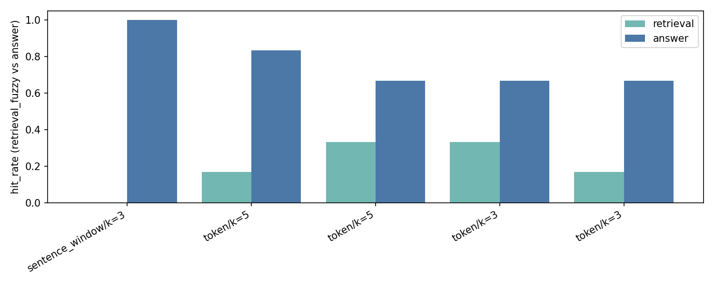
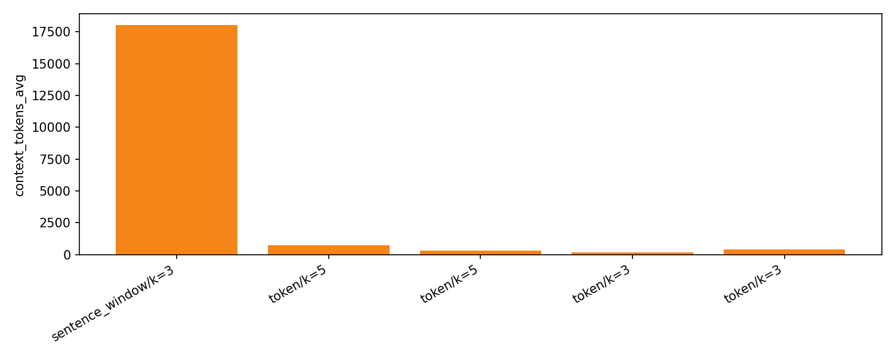

# 作业一 · 句子切片检索实验报告

## 声明
- 由于我拥有 OpenAI 官方额度，本实验采用 OpenAI 模型进行评测。
- 为避免“答案语义正确但不包含标准答案原文”导致漏判，补充了 LLM 评审指标作参考。
- 测试数据为《鬼吹灯》小说前 6 章（中文长文）。

## 一、实验配置
- 方法范围：Token 切片、Sentence Window 切片
- 数据来源：`chunking_research/docs`（中文长文）
- 问题集：`chunking_research/queries.json`（N=6）
- 模型配置：
  - LLM=`gpt-5`
  - Embedding=`text-embedding-3-large`
- 评测指标：
  - 相关性：回答/检索 strict 命中 + fuzzy 命中（默认阈值 `0.6`）
  - 评审（可选）：correctness / faithfulness / coverage + verdict（用于 TopN 二阶段）
  - 成本：`context_tokens_avg` 与冗余度

## 二、关键结论
- 质量优先（更鲁棒，成本高）：Sentence Window `window_size=3, top_k=3`
  - 成绩：`judge_verdict_rate=1.00`；成本：`context_tokens_avg≈18048`
  - 适用：答案必须全面严谨的关键问答；可接受高延迟/高费用
- 均衡首选（推荐默认）：Token `chunk_size=256, overlap=32, top_k=5`
  - 成绩：`judge_verdict_rate≈0.83`，`answer_hit_fuzzy_rate≈0.50`；成本：`context_tokens_avg≈729`
  - 适用：通用型问答，质量-成本平衡最优
- 低成本备选（快速便宜）：Token `chunk_size=128, overlap=16, top_k=5`
  - 成绩：`judge_verdict_rate≈0.67`；成本：`context_tokens_avg≈324`
  - 适用：延迟/费用敏感场景；作为回退档

> 推荐落地：默认使用“均衡首选”；遇到召回困难/高风险问答，再切“质量优先”。

## 三、结果总览（摘要）
| method | params | top_k | judge_verdict_rate | answer_hit_fuzzy_rate | ctx_tokens_avg |
|---|---|---:|---:|---:|---:|
| sentence_window | {window_size: 3} | 3 | 1.00 | 0.33 | 18048 |
| token | {chunk_size: 256, overlap: 32} | 5 | 0.83 | 0.50 | 729 |
| token | {chunk_size: 128, overlap: 16} | 5 | 0.67 | 0.33 | 324 |

数据来源：`chunking_research/results/summary.csv`

## 四、代表性样例（Top 配置）
- Token 256/32, top_k=5（judge=1.0）
  - Q 胡国华的舅舅在见到所谓新媳妇后做了什么决定？
  - GT 高兴地又给了胡国华十块大洋表示支持
  - A 他很高兴，给了胡国华十块大洋。
- Token 256/32, top_k=5（judge=1.0）
  - Q 孙先生为什么死的早？
  - GT 被女尸的尸气喷中，尸毒寒气透骨，一直没能痊愈，过了几年就一命归西了
  - A 因为那次被尸气喷中，尸毒寒气透骨，久未痊愈，几年后便一命归西。
- Sentence Window w=3, top_k=3（judge=1.0；上下文极长）
  - Q 胡国华为什么会想到用白纸人冒充未过门的媳妇？
  - GT 因为他败光家产又嗜赌吸烟，急需钱……以此骗取钱财。
  - A 因为他穷得没钱又好赌、嗜烟成癖，想骗舅舅凑钱……做白纸人冒充新媳妇以骗取银两。

更多样例见：`chunking_research/results/results.jsonl`

## 五、分析与权衡
- Sentence Window
  - 优势：对长文“语义改写/概括”更稳，`judge_verdict_rate`高；
  - 代价：窗口文本带来超长上下文（≈1.8万 tokens），推理时延/费用显著增加；
  - 建议：仅在关键问答、质量冲刺时使用。
- Token 切片
  - `chunk_size=256, overlap=32`：召回稳定，冗余适中，综合最优；
  - `chunk_size=128, overlap=16`：成本更低，但命中与覆盖略降；
  - 提示：`top_k` 从 3→5 通常提升召回，但会增加上下文长度与费用。
- 指标解读
  - strict 对中文改写不友好；建议以 `answer_hit_fuzzy_rate` 与 `judge_verdict_rate` 为主；
  - 成本侧关注 `context_tokens_avg`，避免不必要的窗口冗长。

## 六、推荐参数（用于生产）
- 默认：Token `chunk_size=256, overlap=32, top_k=5`
- 低成本：Token `chunk_size=128, overlap=16, top_k=5`
- 质量冲刺：Sentence Window `window_size=3, top_k=3`

## 七、复现实验（最小命令）
- 快速基线（不评审，快）：
```
python -m chunking_research.main \
  --methods token,sentence_window --topk 5 \
  --token_chunk_sizes 256 --token_overlaps 32 \
  --window_sizes 3 --fuzzy_threshold 0.6 --no_judge
```
- 启用评审（更可信）：
```
python -m chunking_research.main \
  --methods token,sentence_window --topk 5 \
  --token_chunk_sizes 256 --token_overlaps 32 \
  --window_sizes 3 --fuzzy_threshold 0.6
```

说明：如需更快，可将 `top_k` 调为 `3`，或切换到 `chunk_size=128, overlap=16`。

## 八、指标可视化




## 九、自动汇总（参考）
下表为当前参数网格的前五名配置（优先回答命中，其次检索命中，最后上下文成本）：

| method | top_k | params | judge_verdict_rate | answer_hit_fuzzy_rate | answer_hit_rate | retrieval_hit_fuzzy_rate | ctx_tokens_avg | redundancy(avg) |
|---|---:|---|---:|---:|---:|---:|---:|---:|
| token | 3 | {"chunk_size": 128, "chunk_overlap": 32, "separator": "\n"} | 0.667 | 0.167 | 0.000 | 0.333 | 194 | 0.000 |
| token | 5 | {"chunk_size": 128, "chunk_overlap": 16, "separator": "\n"} | 0.667 | 0.333 | 0.000 | 0.333 | 324 | 0.000 |
| token | 3 | {"chunk_size": 256, "chunk_overlap": 16, "separator": "\n"} | 0.667 | 0.167 | 0.000 | 0.167 | 408 | 0.000 |
| token | 5 | {"chunk_size": 256, "chunk_overlap": 32, "separator": "\n"} | 0.833 | 0.500 | 0.000 | 0.167 | 729 | 0.000 |
| sentence_window | 3 | {"window_size": 3, "window_metadata_key": "window", "original_text_metadata_key": "original_text"} | 1.000 | 0.333 | 0.000 | 0.000 | 18048 | 0.000 |

### 观察与建议
- `chunk_size` 与 `chunk_overlap` 的权衡：chunk 变大命中上升、成本升高；overlap 过小信息缺失，过大重复严重。
- 句子窗口：在相近 `top_k` 下更有助于生成质量，但要关注上下文成本；务必启用 `MetadataReplacementPostProcessor`。
- 成本控制：重点监控 `context_tokens_avg`，避免不必要的长上下文。
